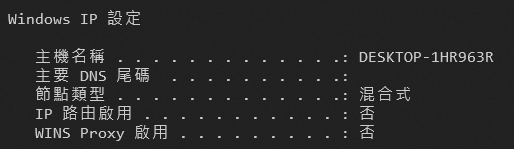
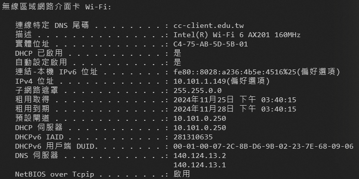
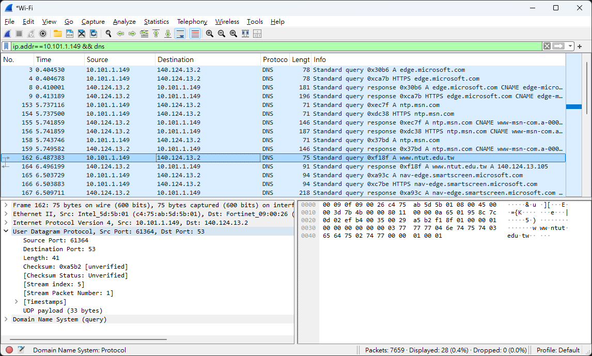
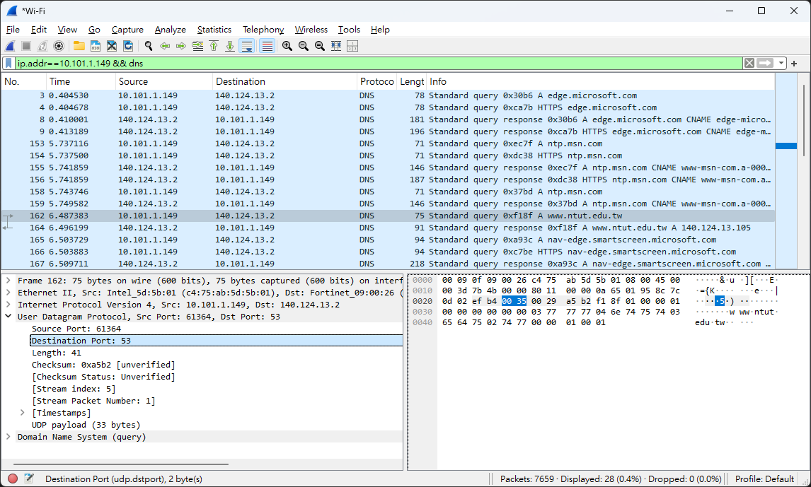
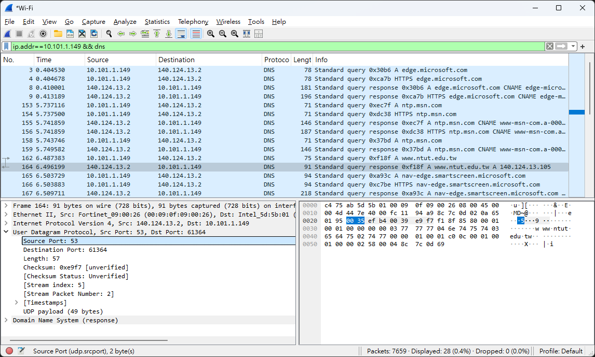
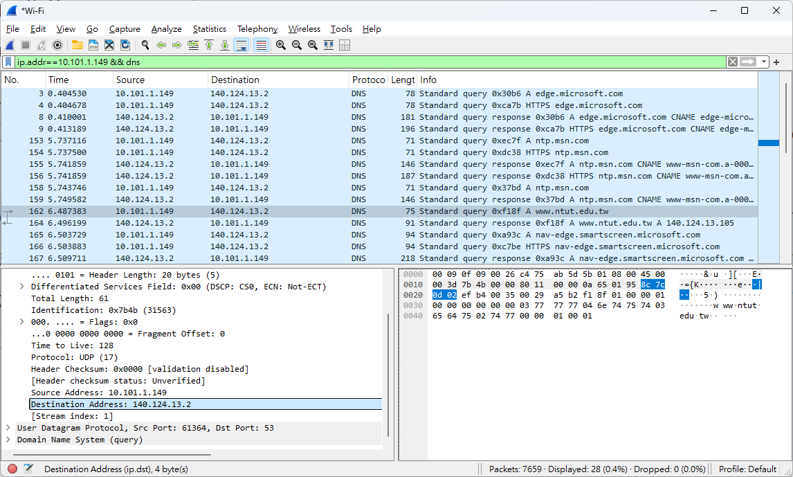
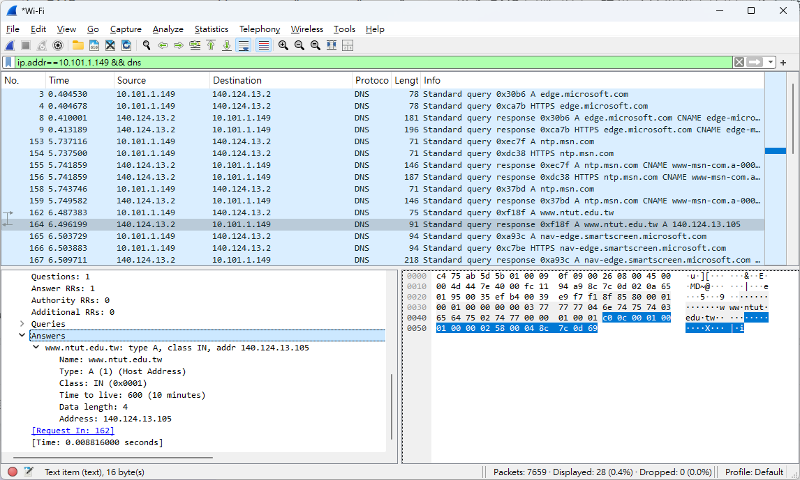

# 計算機網路 lab3

## 資工三 111590012 林品緯

### 1.

Host name: DESKTOP-1HR963R

### 2.

Physical (data-link) address: C4-75-AB-5D-5B-01

### 3.

IP address: 10.101.1.149

### 4.

IP address of the default gateway: 10.101.0.250

### 5.

UDP

### 6.

Destination port for the DNS query message: 53
Source port of DNS response message: 53

### 7.

140.124.13.2

是，他們是一樣的

### 8.

提供一個 answers

包含 Name, Type, Class, Time to live, Date length 和 Address

