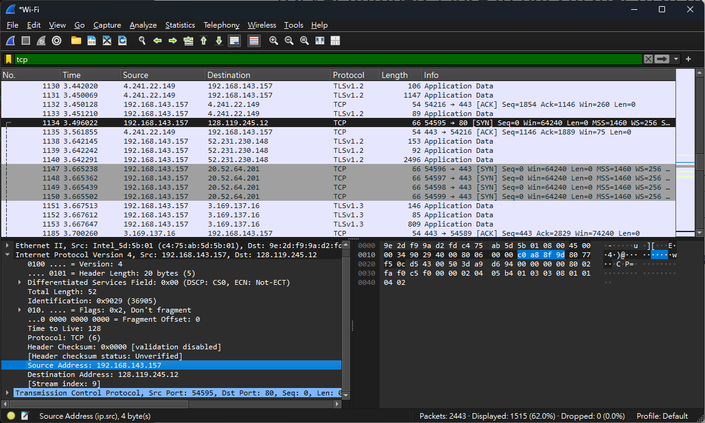

# 計算機網路 lab4

## 資工三 111590012 林品緯

### 1.

IP: 192.168.143.157

Port: 54595

### 2.

Sequence number: 0

SYN flag: 1

Flags: 0x002

### 3.

ACKnowledgement value: 1

ACK number 為 client 傳過來的 sequence number 加 1

### 4.

Window size: 29200

